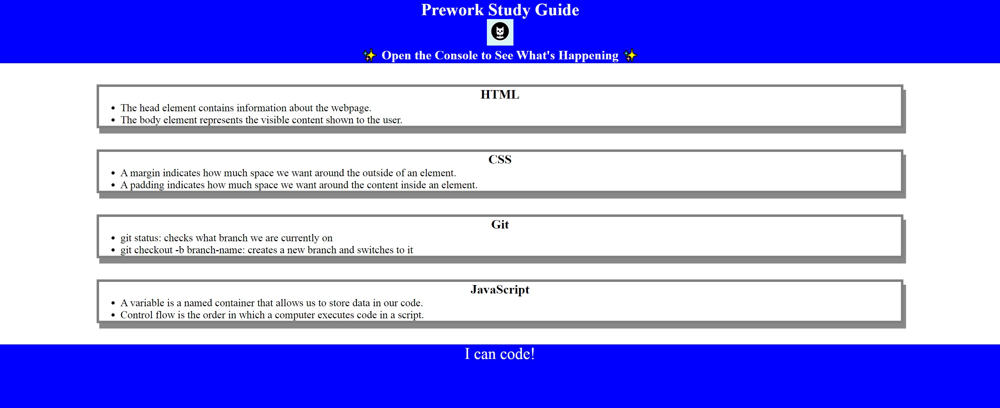

# Prework Study Guide Webpage

## Description

This project is an assignment that students are required to complete before the start of the Front-End Web Development bootcamp. The purpose of this project is to introduce students to the basics of programming and ensure that they have the foundational knowledge needed to succeed in the bootcamp. It involves a series of exercises and challenges that cover topics such as HTML, CSS, JavaScript and Git.

## Folder Structure

- **index.html**: The Main HTML file for Prework Study Guide.
- **asset:** includes 3 files for styles (css, js) & image
    - **css:** css/js files for styling
    - **img:** images file for website
- **README.md:** This file.
- **Prework-Screenshoot.jpg:** Preview for this HTML.

## Screenshoot
[Visit the HTML page](https://celia103.github.io/prework-study-guide/)

## Installation

N/A

## Credits

N/A

## License

Please refer to the LICENSE in the repo.
